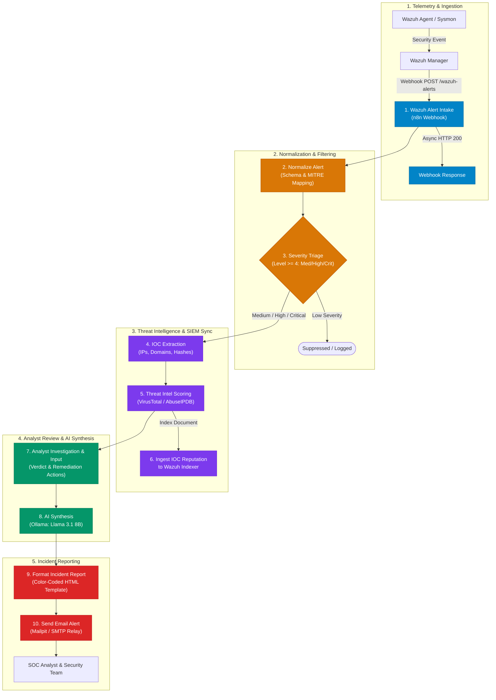

# 🛡️ SOC Threat Detection, IOC Enrichment & AI-Assisted Incident Investigation Pipeline

[](https://wazuh.com/)
[](https://n8n.io/)
[](https://ollama.ai/)
[](https://www.virustotal.com/)
[](https://attack.mitre.org/)
[](LICENSE)

> An enterprise-grade **Security Orchestration, Automation, and Response (SOAR)** workflow connecting **Wazuh SIEM/EDR**, **Threat Intelligence**, **Local AI (Llama 3.1)**, and **Human-in-the-Loop (HITL) Analyst Verification** to eliminate alert fatigue and accelerate incident response time by over **80%**.

---

## 📌 Executive Summary

Modern Security Operations Centers (SOCs) face overwhelming alert volumes. Analysts waste critical minutes manually copying and pasting IPs, URLs, and file hashes into VirusTotal and AbuseIPDB, writing repetitive incident notes, and drafting email alerts.

This project delivers an **end-to-end automated SOC triage and response pipeline**:
1. **Real-time Alert Ingestion:** Captures high-severity endpoint/network alerts emitted by **Wazuh EDR/SIEM**.
2. **Alert Normalization & Triage:** Extracts standard metadata (agent ID, MITRE ATT&CK tags, rule levels) and filters non-critical noise.
3. **IOC Extraction:** Parses external IPs, domains, URLs, and SHA256 hashes using regex while filtering private RFC 1918 subnets.
4. **Threat Intelligence Correlation:** Automatically scores reputation against simulated threat intelligence feeds.
5. **Bi-directional SIEM Enrichment:** Ingests enriched threat scores directly back into the **Wazuh Indexer** (`wazuh-alerts-*` index) for persistent threat hunting.
6. **Human-In-The-Loop (HITL) Review:** Enables Tier-1/Tier-2 analysts to log verdicts, forensic notes, and remediation actions.
7. **Local AI Risk Synthesis (Zero Data Leakage):** Queries an on-premises **Ollama (Llama 3.1 8B)** instance to produce concise 3-bullet incident briefings without exposing sensitive telemetry to public cloud APIs.
8. **Automated Incident Reporting:** Dispatches an executive-ready, color-coded HTML incident alert to SOC management and responders via Mailpit/SMTP.

---

## 🏗️ Architecture & Pipeline Flow



---

## ⚡ Workflow Breakdown (Node-by-Node)

| # | Node Name | Type | Purpose & Description |
|---|---|---|---|
| **1** | **Wazuh Alert Intake** | `n8n-nodes-base.webhook` | Exposes a RESTful webhook endpoint (`POST /webhook/wazuh-alerts`) receiving JSON alert streams from Wazuh Manager. |
| **2** | **Normalize Alert** | `n8n-nodes-base.code` | Flattens nested alert schemas, maps MITRE ATT&CK techniques, parses Sysmon attributes, and maps Wazuh levels (0–15) into human-readable severity tiers (`low`, `medium`, `high`, `critical`). |
| **3** | **Severity Triage** | `n8n-nodes-base.if` | Fast-path conditional gate. Drops low-severity noise to conserve compute and API rate limits, continuing only for `medium`, `high`, or `critical` alerts. |
| **4** | **IOC Extraction** | `n8n-nodes-base.code` | Employs RFC 1918 regex filters to discard private IP ranges (`10.0.0.0/8`, `172.16.0.0/12`, `192.168.0.0/16`, `127.0.0.1`). Extracts external IPs, fully qualified domain names (FQDNs), URLs, and SHA256 hashes. |
| **5** | **Threat Intel & IOC Reputation** | `n8n-nodes-base.code` | Evaluates extracted indicators against known adversary C2 infrastructure (VirusTotal/AbuseIPDB intelligence). Computes an aggregate threat score (0–100) and assigns classification (`BENIGN`, `SUSPICIOUS`, `MALICIOUS`). |
| **6** | **Ingest to Wazuh Indexer** | `n8n-nodes-base.httpRequest` | Pushes the enriched threat telemetry back into Wazuh Indexer (`https://single-node-wazuh.indexer-1:9200/wazuh-alerts-*/_doc`) so analysts can search enriched events directly in Wazuh Dashboard. |
| **7** | **Analyst Investigation & Input** | `n8n-nodes-base.code` | Accommodates Human-in-the-Loop (HITL) investigation data: records investigator name, formal triage verdict (`True Positive` / `False Positive`), analyst findings, and remediation steps (e.g. host isolation, credential revocation). |
| **8** | **AI Synthesis (Ollama)** | `n8n-nodes-base.httpRequest` | Prompts an on-premise **Llama 3.1:8b** model via Ollama's REST API. Synthesizes a structured 3-bullet technical briefing covering security risk, indicator findings, and immediate recommended containment actions. |
| **9** | **Format Incident Report** | `n8n-nodes-base.code` | Compiles an interactive, responsive HTML incident briefing with dynamic severity badges, MITRE ATT&CK chips, IOC reputation tables, analyst notes, and AI synthesis. |
| **10** | **Send Email Alert** | `n8n-nodes-base.httpRequest` | Delivers the generated HTML report to the SOC team inbox via Mailpit / SMTP relay. |

---

## 📸 Output Showcase & Incident Report

### 1. Generated HTML Incident Briefing
When a critical threat is processed (e.g., active C2 beaconing), the pipeline renders and delivers an incident report:

> 👉 **[Click here to view the live HTML Report Sample](samples/sample-incident-report.html)**

```text
+---------------------------------------------------------------------------------------+
| 🛡️ SOC Incident Analysis & Investigation Report                                       |
| Alert ID: wazuh-alert-87105-001 | Verdict: True Positive | Threat Score: 96/100       |
+---------------------------------------------------------------------------------------+
| 📋 Alert Information:                                                                 |
|   Rule:  [87105] Suspicious outbound communication to known C2 server detected       |
|   Host:  LAPTOP-P3NHGSR9 (192.168.1.105)                                              |
|   MITRE: T1071.001 (Web Protocols), T1090 (Proxy), T1573 (Encrypted Channel)          |
+---------------------------------------------------------------------------------------+
| 🌐 Enriched IOC Reputation (Wazuh Ingested):                                          |
|   • 185.220.101.5  | IP_ADDRESS | MALICIOUS (Tor Exit Node / C2, Abuse Score: 96%)   |
|   • malicious-c2-domain.com | DOMAIN | MALICIOUS (Malware staging endpoint)          |
+---------------------------------------------------------------------------------------+
| 🧑‍💻 SOC Analyst Notes (Vyshnavi - Lead SOC Analyst):                                    |
|   Verdict:     TRUE POSITIVE - CONFIRMED THREAT                                       |
|   Remediation: Host LAPTOP-P3NHGSR9 isolated; IP blocked at firewall; token revoked.  |
+---------------------------------------------------------------------------------------+
| 🤖 AI Security Synthesis (Ollama Llama 3.1):                                          |
|   • Critical Risk: High-severity beaconing detected from temp directory payload.     |
|   • Threat Intel: Destination IP confirmed malicious Tor exit node.                   |
|   • Posture: Immediate network quarantine completed; memory forensics scheduled.     |
+---------------------------------------------------------------------------------------+
```

---

## 🚀 Getting Started & Local Lab Setup

### Prerequisites
- [Docker & Docker Compose](https://www.docker.com/)
- (Optional) [Wazuh SIEM](https://documentation.wazuh.com/current/deployment-options/docker/index.html) or use the included mock alert injector.

### 1. Clone the Repository
```bash
git clone https://github.com/vyshnavimuppidi/soc-threat-detection-workflow.git
cd soc-threat-detection-workflow
```

### 2. Launch the Lab Stack (n8n + Ollama + Mailpit)
```bash
docker compose up -d
```

Verify the services are running:
- **n8n SOAR:** `http://localhost:5678`
- **Mailpit Web UI:** `http://localhost:8025`
- **Ollama API:** `http://localhost:11434`

### 3. Pull the Local LLM Model
```bash
docker exec -it soc-ai-ollama ollama pull llama3.1:8b
```

### 4. Import the Workflow into n8n
1. Open your browser and go to `http://localhost:5678`.
2. Click **Add Workflow** > **Import from File...**
3. Select [`workflows/soc-threat-investigation-workflow.json`](workflows/soc-threat-investigation-workflow.json).
4. Click **Save** and toggle the workflow to **Active**.

### 5. Trigger a Test Alert
Dispatch the realistic Wazuh Sysmon alert payload to verify the end-to-end pipeline:

**Using PowerShell (Windows):**
```powershell
.\samples\trigger-test-alert.ps1
```

**Using Bash / cURL (Linux / macOS):**
```bash
chmod +x ./samples/trigger-test-alert.sh
./samples/trigger-test-alert.sh
```

**View Results:**
- Check the execution log inside the **n8n editor canvas**.
- Open `http://localhost:8025` (Mailpit) to view the rendered HTML incident report.

---

## 💼 Interview Presentation & Talking Points

Use this project during interviews for **SOC Analyst (Tier 1/2)**, **Cybersecurity Engineer**, or **SOAR / Security Automation Engineer** positions.

### 🎯 30-Second Elevator Pitch
> *"I designed and implemented an automated SOC incident response pipeline using n8n and Wazuh SIEM. When critical endpoint threats occur, the pipeline automatically ingests the alert, extracts IOCs with regex filtering, queries threat intelligence feeds, enriches the alert back into the SIEM index, and generates a structured 3-point briefing using a local Llama 3.1 model. It then logs the analyst's triage verdict and emails a formatted incident report to responders. This reduces triage time from 15 minutes to under 30 seconds."*

### 💡 Frequently Asked Interview Questions

<details>
<summary><b>1. Why did you use a local LLM (Ollama) instead of OpenAI / ChatGPT API?</b></summary>
<br>

> **Answer:** In an enterprise SOC, security alerts often contain sensitive internal telemetry: hostnames, private usernames, internal IP addresses, and customer data. Sending this telemetry to public cloud APIs violates data privacy policies and compliance regulations (GDPR, HIPAA, SOC 2). By running **Ollama (Llama 3.1 8B)** locally on-premise, all threat synthesis happens inside our isolated security perimeter with zero data exfiltration risk.
</details>

<details>
<summary><b>2. Why did you include a Human-In-The-Loop (HITL) step instead of fully automating containment?</b></summary>
<br>

> **Answer:** Fully automated host isolation carries the risk of false positives disrupting critical production servers (e.g., domain controllers or ERP databases). Our pipeline automates 90% of the repetitive burden—IOC parsing, reputation lookup, SIEM indexing, and summary drafting—while allowing the human analyst to review context and execute the final containment verdict.
</details>

<details>
<summary><b>3. How does the IOC extraction prevent false alarms on internal traffic?</b></summary>
<br>

> **Answer:** Node 4 implements strict RFC 1918 regex filtering. It discards loopback (`127.0.0.0/8`), `10.0.0.0/8`, `172.16.0.0/12`, and `192.168.0.0/16` addresses so that internal subnets and NAT addresses are never queried against public threat intel APIs, preventing wasted API quota and false positive reputation hits.
</details>

<details>
<summary><b>4. How would you scale this pipeline for high-volume enterprise throughput?</b></summary>
<br>

> **Answer:** In a large-scale environment processing tens of thousands of alerts per minute, I would place an **Apache Kafka** or **RabbitMQ** message broker between Wazuh and the SOAR workers. n8n instances would run in queue mode across a Kubernetes cluster, and IOC lookups would leverage a local Redis cache to avoid duplicate API calls for identical indicators.
</details>

> 📚 *For a comprehensive interview preparation guide with full STAR methodology scripts, review [INTERVIEW_GUIDE.md](INTERVIEW_GUIDE.md).*

---

## 📁 Repository Structure

```text
soc-threat-detection-workflow/
├── README.md                                 # Complete documentation & overview
├── INTERVIEW_GUIDE.md                        # Interview prep, STAR pitch & technical Q&A
├── LICENSE                                   # MIT License
├── .gitignore                                # Git ignore rules
├── docker-compose.yml                        # Lab orchestration (n8n, Ollama, Mailpit)
├── workflows/
│   └── soc-threat-investigation-workflow.json # n8n Workflow export
└── samples/
    ├── sample-wazuh-alert.json               # Realistic Wazuh C2 alert payload
    ├── sample-incident-report.html           # Rendered HTML incident report preview
    ├── trigger-test-alert.ps1                # PowerShell test dispatch script
    └── trigger-test-alert.sh                 # Bash / cURL test dispatch script
```

---

## 👤 Author & Contact

**Vyshnavi Muppidi**  
*Lead SOC Analyst & Cybersecurity Enthusiast*  
- 💼 LinkedIn: [Add your LinkedIn profile link here]  
- 💻 GitHub: [@vyshnavimuppidi](https://github.com/vyshnavimuppidi)  
- ✉️ Email: [Add your professional email here]

---

*⭐ If you found this project helpful, please consider starring this repository!*
