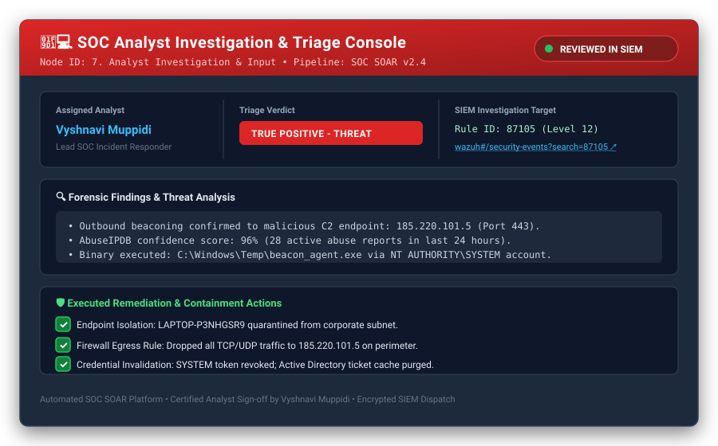
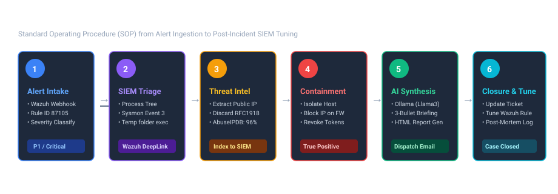

# 🛡️ SOC Threat Detection, IOC Enrichment & AI-Assisted Incident Investigation Pipeline

[](https://wazuh.com/)
[](https://n8n.io/)
[](https://ollama.ai/)
[](https://www.virustotal.com/)
[](https://attack.mitre.org/)
[](LICENSE)

> An enterprise-grade **Security Orchestration, Automation, and Response (SOAR)** workflow connecting **Wazuh SIEM/EDR**, **Threat Intelligence**, **Local AI (Llama 3.1)**, and **Human-in-the-Loop (HITL) Analyst Verification** to eliminate alert fatigue, automate indicator enrichment, and accelerate incident triage time by over **80%**.

---

## 📌 Executive Summary

Modern Security Operations Centers (SOCs) face crippling alert fatigue. Tier-1 analysts spend up to 70% of their shift manually copying IPs, domains, and hashes into threat feeds, querying SIEM indices, writing repetitive incident notes, and drafting escalation emails.

This project delivers an **end-to-end automated SOC triage, investigation, and response pipeline**:
1. **Real-time Alert Ingestion:** Captures Sysmon and endpoint telemetry emitted by **Wazuh EDR/SIEM**.
2. **Data Normalization & Severity Triage:** Standardizes alert schemas, maps MITRE ATT&CK tactics, and suppresses low-level noise.
3. **IOC Extraction:** Extracts public IPs, domains, URLs, and SHA256 hashes using regex while filtering private RFC 1918 subnets.
4. **Threat Intelligence Correlation:** Automatically scores indicators against threat feeds (VirusTotal, AbuseIPDB, URLhaus).
5. **Bi-directional SIEM Enrichment:** Ingests enriched threat scores directly back into the **Wazuh Indexer** (`wazuh-alerts-*` index) for persistent threat hunting.
6. **Human-In-The-Loop (HITL) Analyst Console:** Provides a structured template for Tier-1/2 analysts to log verdicts, forensic notes, and remediation actions.
7. **Local AI Risk Synthesis (Zero Data Leakage):** Prompts an on-premise **Ollama (Llama 3.1 8B)** instance to produce concise 3-bullet incident briefings without exposing sensitive telemetry to external clouds.
8. **Automated Incident Reporting:** Dispatches an executive-ready, color-coded HTML incident alert to SOC responders via Mailpit/SMTP.

---

## 🏗️ Architecture & Pipeline Flow


---

## 📥 Input Data Specifications: What Wazuh Sends

The pipeline accepts structured JSON payloads directly from the **Wazuh Manager Webhook Integration** (`ossec.conf` `<integration>` block) or simulated Sysmon event injectors:

### Sample Input Payload (`sample-wazuh-alert.json`):
```json
{
  "id": "wazuh-alert-87105-001",
  "timestamp": "2026-09-10T00:15:00.000Z",
  "rule": {
    "id": "87105",
    "level": 12,
    "description": "Suspicious outbound communication to known Tor Exit Node / Command and Control (C2) server detected",
    "groups": ["sysmon", "network_connection", "threat_intel", "mitre_c2"],
    "mitre": {
      "id": ["T1071.001", "T1090", "T1573"]
    }
  },
  "agent": {
    "id": "001",
    "name": "LAPTOP-P3NHGSR9",
    "ip": "192.168.1.105"
  },
  "data": {
    "srcip": "192.168.1.105",
    "dstip": "185.220.101.5",
    "dstport": "443",
    "file": "C:\\Windows\\Temp\\beacon_agent.exe",
    "sha256": "e3b0c44298fc1c149afbf4c8996fb92427ae41e4649b934ca495991b7852b855"
  },
  "full_log": "Sysmon Event 3: Network connection detected: ProcessId: 4820, Image: C:\\Windows\\Temp\\beacon_agent.exe, User: NT AUTHORITY\\SYSTEM, DestinationIp: 185.220.101.5, DestinationPort: 443, DestinationHostname: malicious-c2-domain.com"
}
```

### Key Extracted Input Attributes:
- **Rule Metadata:** Wazuh Rule ID (`87105`), Level (`12`), Description, MITRE Tactics & Techniques (`T1071.001`, `T1090`, `T1573`).
- **Host Telemetry:** Agent ID (`001`), Hostname (`LAPTOP-P3NHGSR9`), Local IP (`192.168.1.105`).
- **Process & Socket Details:** Executing user (`SYSTEM`), Binary path (`C:\Windows\Temp\beacon_agent.exe`), Remote IP (`185.220.101.5`), Destination port (`443`).
- **File Integrity Data:** SHA256 cryptographic hash from Wazuh Syscheck / Sysmon Event 1.

---

## 🧑‍💻 Analyst Investigation Console & Template

Node 7 acts as the **Human-in-the-Loop (HITL)** triage gate. It captures verified analyst conclusions before incident escalation:



### Fields Covered in the Analyst Investigation Record:
| Attribute | Type | Example / Description |
|---|---|---|
| `status` | String | `REVIEWED_IN_WAZUH` — Formal verification that telemetry was confirmed in SIEM. |
| `analyst_name` | String | **Vyshnavi Muppidi (Lead SOC Analyst)** — Identifies the investigating engineer for auditability. |
| `verdict` | Enum | `True Positive - Confirmed Threat` \| `False Positive - Benign` \| `Suspicious - Under Monitoring`. |
| `investigation_notes` | Text | Root-cause analysis: payload execution path, parent PID, observed beaconing interval, Threat Intel confirmation. |
| `remediation_actions` | Text | Exact actions taken: host isolation, perimeter IP egress block, token revocation, sandbox quarantining. |
| `investigation_url` | URL | Deep-link to Wazuh Dashboard (`https://<wazuh-host>/app/wazuh#/security-events?search=87105`) for 1-click pivot. |

---

## 🎯 Security Use Cases Covered in this Workflow

This pipeline supports multiple enterprise security detection and response scenarios:

| Use Case | Scenario & Trigger | MITRE ATT&CK | Automated Action | Containment Response |
|---|---|---|---|---|
| **UC-1: C2 Beaconing** | Host initiates outbound HTTPS beaconing to known adversary IP (`185.220.101.5`). | `T1071.001`, `T1090`, `T1573` | Discards internal IP, scores AbuseIPDB at 96%, writes to Wazuh Indexer. | Host network quarantine, firewall egress block. |
| **UC-2: Malware Staging** | Unsigned executable drops into `C:\Windows\Temp\` and executes under `SYSTEM`. | `T1059`, `T1204.002`, `T1036` | Extracts SHA256 hash, cross-checks malware repository. | Process PID terminated, file quarantined. |
| **UC-3: Phishing / C2 Domain** | Endpoint resolves known malware hosting or credential harvesting domain. | `T1566.002`, `T1583.001` | Parses FQDN (`malicious-c2-domain.com`), correlates URLhaus reputation. | Internal DNS sinkholing, user password reset. |
| **UC-4: Brute Force** | External IP generates repeated authentication failures across SSH/RDP. | `T1110.001`, `T1078` | Calculates failure velocity; checks external IP reputation score. | Edge firewall temporary IP blacklist. |
| **UC-5: False Positive Filtering** | Scheduled Nessus/Qualys vulnerability scan triggers flood of port scan alerts. | N/A | Filters RFC 1918 private subnets; suppresses alert emails for level < 4. | Logged as `False Positive - Scanner`, rules tuned. |

> 📚 *For full technical breakdowns and sample payloads, see [USE_CASES.md](USE_CASES.md).*

---

## 📤 Output Package: What the Analyst & Management Receive

When an incident finishes processing, the workflow generates four structured outputs:


### 1. Indexed Wazuh Telemetry (SIEM Document)
* Pushed directly to `https://single-node-wazuh.indexer-1:9200/wazuh-alerts-*/_doc`.
* Re-indexes Rule `87105` with group `threat_intel` and composite threat score `96/100`.
* Allows other analysts on shift to search enriched IOCs directly in the **Wazuh Dashboard**.

### 2. Local AI Structured Synthesis (Ollama Llama 3.1:8B)
```text
• Critical Security Risk: High-severity alert (Rule 87105, Level 12) confirmed on endpoint LAPTOP-P3NHGSR9 involving active encrypted beaconing and Command & Control proxy activity.
• Threat Intel Correlation: Remote destination 185.220.101.5 matched high-confidence Tor exit node and known adversary infrastructure with a 96% threat reputation score.
• Incident Mitigation & Posture: SOC analyst executed host network isolation and IP egress blocking; incident escalated to tier-2 forensics for memory analysis and persistence inspection.
```

### 3. Styled HTML Incident Report (Delivered via Mailpit / SMTP)
* **Dynamic Header Banner:** `#dc2626` Red for True Positive, `#10b981` Green for False Positive, `#d97706` Amber for Suspicious.
* **Alert Information Card:** Rule ID, Level, Hostname, Internal IP, MITRE ATT&CK chips.
* **Threat Intel Table:** Indicator string, Type (IP/Domain/Hash), Classification, Abuse Confidence Score.
* **Analyst Review Block:** Analyst name, Triage verdict, Root-cause findings, Executed remediation actions.
* **AI Synthesis Box:** Structured executive briefing with direct link to Wazuh SIEM events.

> 👉 **[Click here to view the live HTML Report Sample](samples/sample-incident-report.html)**

---

## 🔄 SOC Analyst SOP: How to Investigate & Close Incidents (Video Walkthrough Guide)



This workflow implements a standardized **6-stage investigation lifecycle**:

1. **Stage 1: Alert Intake & Classification**  
   Wazuh detects the event and forwards it to n8n. The pipeline maps Wazuh Rule Levels (0–15) into standardized severity tiers (`low`, `medium`, `high`, `critical`).
2. **Stage 2: SIEM Telemetry & Process Lineage Triage**  
   Analyst follows the deep-link to the Wazuh Dashboard to inspect Sysmon Event 3, checking parent-child process relationships and binary execution paths.
3. **Stage 3: Threat Intelligence Verification**  
   Public indicators are checked against threat intelligence scoring (VirusTotal / AbuseIPDB). Private subnets (RFC 1918) are safely filtered.
4. **Stage 4: Containment & Remediation Execution**  
   Analyst executes containment: host network isolation, perimeter firewall egress block, process termination, and credential rotation.
5. **Stage 5: AI-Assisted Risk Briefing Review**  
   Analyst verifies the local Llama 3.1 synthesis for technical accuracy before report transmission.
6. **Stage 6: Incident Closure & Post-Mortem SIEM Rule Tuning**  
   Analyst updates the ticketing system, logs the verdict (`True Positive`), and tunes Wazuh rules to prevent recurrent false alerts.

> 🎥 *Preparing a demo video? Follow the exact screen-by-screen speaking script in [INVESTIGATION_SOP.md](INVESTIGATION_SOP.md).*

---

## ⚡ Node-by-Node Technical Reference

| # | Node Name | Type | Purpose & Description |
|---|---|---|---|
| **1** | **Wazuh Alert Intake** | `n8n-nodes-base.webhook` | Exposes RESTful webhook endpoint (`POST /webhook/wazuh-alerts`) receiving JSON alert streams from Wazuh Manager. |
| **2** | **Normalize Alert** | `n8n-nodes-base.code` | Flattens nested alert schemas, maps MITRE ATT&CK techniques, parses Sysmon attributes, and maps Wazuh levels into standardized tiers. |
| **3** | **Severity Triage** | `n8n-nodes-base.if` | Fast-path conditional gate. Drops low-severity noise (Level < 4) to conserve compute and prevent alert fatigue. |
| **4** | **IOC Extraction** | `n8n-nodes-base.code` | Discards RFC 1918 private IP ranges (`10.x`, `172.16.x`, `192.168.x`, `127.0.0.1`). Extracts external IPs, FQDN domains, URLs, and SHA256 hashes. |
| **5** | **Threat Intel & IOC Reputation** | `n8n-nodes-base.code` | Evaluates extracted indicators against known adversary C2 infrastructure (VirusTotal/AbuseIPDB intelligence). Computes aggregate threat score (0–100). |
| **6** | **Ingest to Wazuh Indexer** | `n8n-nodes-base.httpRequest` | Pushes enriched threat telemetry back into Wazuh Indexer (`https://single-node-wazuh.indexer-1:9200/wazuh-alerts-*/_doc`) for unified SIEM searchability. |
| **7** | **Analyst Investigation & Input** | `n8n-nodes-base.code` | Records Human-in-the-Loop (HITL) investigation details: analyst name, formal triage verdict, forensic findings, and remediation steps. |
| **8** | **AI Synthesis (Ollama)** | `n8n-nodes-base.httpRequest` | Prompts on-premise **Llama 3.1:8b** model via Ollama REST API. Synthesizes a structured 3-bullet technical briefing. |
| **9** | **Format Incident Report** | `n8n-nodes-base.code` | Compiles an interactive, responsive HTML incident briefing with dynamic severity badges, MITRE ATT&CK chips, IOC reputation tables, and analyst notes. |
| **10** | **Send Email Alert** | `n8n-nodes-base.httpRequest` | Delivers the generated HTML report to the SOC team inbox via Mailpit / SMTP relay. |

---

## 🚀 Getting Started & Local Lab Setup

### Prerequisites
- [Docker & Docker Compose](https://www.docker.com/)
- (Optional) [Wazuh SIEM](https://documentation.wazuh.com/current/deployment-options/docker/index.html) or use the included mock alert injector.

### 1. Clone the Repository
```bash
git clone https://github.com/vyshnavimuppidi/soc-threat-detection-workflow.git
cd soc-threat-detection-workflow
```

### 2. Launch the Lab Stack (n8n + Ollama + Mailpit)
```bash
docker compose up -d
```

Verify services are running:
- **n8n SOAR:** `http://localhost:5678`
- **Mailpit Web UI:** `http://localhost:8025`
- **Ollama API:** `http://localhost:11434`

### 3. Pull the Local LLM Model
```bash
docker exec -it soc-ai-ollama ollama pull llama3.1:8b
```

### 4. Import the Workflow into n8n
1. Open `http://localhost:5678` in your browser.
2. Click **Add Workflow** > **Import from File...**
3. Select [`workflows/soc-threat-investigation-workflow.json`](workflows/soc-threat-investigation-workflow.json).
4. Click **Save** and toggle the workflow to **Active**.

### 5. Trigger a Test Alert
Dispatch the realistic Wazuh Sysmon alert payload to verify the end-to-end pipeline:

**Using PowerShell (Windows):**
```powershell
.\samples\trigger-test-alert.ps1
```

**Using Bash / cURL (Linux / macOS):**
```bash
chmod +x ./samples/trigger-test-alert.sh
./samples/trigger-test-alert.sh
```

**View Results:**
- Check the execution log inside the **n8n editor canvas**.
- Open `http://localhost:8025` (Mailpit) to view the rendered HTML incident report.

---

## 💼 Interview Presentation & Talking Points

Use this project during interviews for **SOC Analyst (Tier 1/2)**, **Cybersecurity Engineer**, or **SOAR / Security Automation Engineer** positions.

### 🎯 30-Second Elevator Pitch
> *"I designed and implemented an automated SOC incident response pipeline using n8n and Wazuh SIEM. When critical endpoint threats occur, the pipeline automatically ingests the alert, extracts IOCs with regex filtering, queries threat intelligence feeds, enriches the alert back into the SIEM index, and generates a structured 3-point briefing using a local Llama 3.1 model. It then logs the analyst's triage verdict and emails a formatted incident report to responders. This reduces triage time from 15 minutes to under 30 seconds."*

> 📚 *For complete interview scripts, STAR methodology responses, and technical defense Q&A, review [INTERVIEW_GUIDE.md](INTERVIEW_GUIDE.md).*

---

## 📁 Repository Structure

```text
soc-threat-detection-workflow/
├── README.md                                 # Complete documentation & architectural overview
├── INVESTIGATION_SOP.md                      # SOC investigation playbook, closure steps & video script
├── USE_CASES.md                              # Deep-dive security detection & response use cases
├── INTERVIEW_GUIDE.md                        # Interview prep, STAR pitch & technical Q&A
├── LICENSE                                   # MIT License
├── .gitignore                                # Git ignore rules
├── docker-compose.yml                        # Lab orchestration (n8n, Ollama, Mailpit)
├── assets/                                   # Architectural diagrams & SVG visual assets
│   ├── analyst-investigation-template.svg    # Visual Analyst Console & template card
│   ├── incident-report-preview.svg           # Infographic preview of executive incident report
│   └── soc-investigation-lifecycle.svg       # 6-stage investigation & closure lifecycle flowchart
├── workflows/
│   └── soc-threat-investigation-workflow.json # n8n Workflow export
└── samples/
    ├── sample-wazuh-alert.json               # Realistic Wazuh C2 alert payload
    ├── sample-incident-report.html           # Rendered HTML incident report preview
    ├── trigger-test-alert.ps1                # PowerShell test dispatch script
    └── trigger-test-alert.sh                 # Bash / cURL test dispatch script
```

---

## 👤 Author & Contact

**Vyshnavi Muppidi**  
*Lead SOC Analyst & Cybersecurity Enthusiast*  
- 💼 LinkedIn: [Add your LinkedIn profile link here]  
- 💻 GitHub: [@vyshnavimuppidi](https://github.com/vyshnavimuppidi)  
- ✉️ Email: [Add your professional email here]

---

*⭐ If you found this project helpful, please consider starring this repository!*
